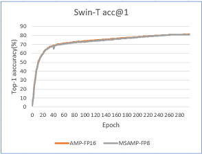
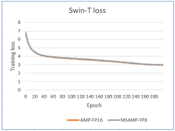

# MS-AMP: Microsoft Automatic Mixed Precision

MS-AMP is an automatic mixed precision package for deep learning developed by Microsoft.

Features:

- Support the new FP8 feature that is introduced by latest accelerators (e.g. H100).
- Speed up math-intensive operations, such as linear layers, by using Tensor Cores.
- Speed up memory-limited operations by accessing one byte compared to half or single-precision.
- Reduce memory requirements for training models, enabling larger models or larger minibatches.
- Speed up communication for distributed model by transmitting lower precision gradients.

## Get started

### Prerequisites

- Latest version of Linux, you're highly encouraged to use Ubuntu 18.04 or later.
- Nvidia GPU(e.g. V100/A100/H100) and compatible drivers should be installed correctly.
  Driver version can be checked by running `nvidia-smi`.
- Python version 3.7 or later (which can be checked by running `python3 --version`).
- Pip version 18.0 or later (which can be checked by running `python3 -m pip --version`).
- CUDA version 11 or later (which can be checked by running `nvcc --version`).
- PyTorch version 1.13 or later (which can be checked by running `python -c "import torch; print(torch.__version__)"`).

### Install MS-AMP

You can clone the source from GitHub.

```bash
git clone https://github.com/Azure/MS-AMP.git
cd MS-AMP
git submodule update --init --recursive
```

If you want to train model with multiple GPU, you need to install specific nccl to support FP8.

```bash
cd third_party/nccl

# V100
make -j src.build NVCC_GENCODE="-gencode=arch=compute_70,code=sm_70"
# A100
make -j src.build NVCC_GENCODE="-gencode=arch=compute_80,code=sm_80"
# H100
make -j src.build NVCC_GENCODE="-gencode=arch=compute_90,code=sm_90"

sudo make install
cd -
```

Then, you can install MS-AMP from source.

```
python3 -m pip install .
make postinstall
```

After that, you can verify the installation by running:

```bash
python3 -c "import msamp; print(msamp.__version__)"
```

### Run unit tests

You can execute the following command to run unit tests.

```
pytest
```

### Usage

Enabling MS-AMP is very simple when traning model on single GPU, you only need to add one line of code `msamp.initialize(model, optimizer, opt_level)` after defining model and optimizer.

Example:

```python
import msamp

# Declare model and optimizer as usual, with default (FP32) precision
model = torch.nn.Linear(D_in, D_out).cuda()
optimizer = torch.optim.AdamW(model.parameters(), lr=1e-3)

# Allow MS-AMP to perform casts as required by the opt_level
model, optimizer = msamp.initialize(model, optimizer, opt_level="O1")
...
```

For distributed training job, you need to add `optimizer.all_reduce_grads(model)` after backward to reduce gradients in process group.

Example:

```python
scaler = torch.cuda.amp.GradScaler()
for batch_idx, (data, target) in enumerate(train_loader):
    data, target = data.to(device), target.to(device)
    optimizer.zero_grad()
    output = model(data)
    loss = loss(output, target)
    scaler.scale(loss).backward()
    optimizer.all_reduce_grads(model)
    scaler.step(optimizer)
```

A runnable, comprehensive MNIST example demonstrating good practices can be found [here](./examples). For more examples, please go to [MS-AMP-Examples](https://github.com/Azure/MS-AMP-Examples).

Recognized optimizers are torch.optim.Adam and torch.optim.AdamW.

Recognized opt_levels are "O1" and "O2". Try both, and see what gives the best speedup and accuracy for your model.

- O1: We found that directly transitioning weight gradients from FP32 to FP8 in the Transformer Engine leads to a decrease in accuracy. However, this issue is resolved in O1 through the implementation of FP8 for weight gradients and AllReduce communication. This optimization also has the added benefits of saving GPU memory and reducing communication bandwidth.

- O2: From O1 to O2, our main focus is on enabling the use of low-bit data formats for auxiliary tensors in the Adam/AdamW optimizer without any loss in accuracy. Specifically, we are able to maintain accuracy by representing the first-order optimizer state in FP8 and the second-order state in FP16. This optimization has the potential to save up to 62.5% of GPU memory for the optimizer when the model size is particularly large.

Here here details of different MS-AMP optimization levels:
| Optimization Level  | Computation(GEMM) | Comm  | Weight | Weight Gradient | Optimizer States |
| ------------------- | -----------       | ----- | ------ | --------------- | ---------------- |
| FP16 AMP            | FP16              | FP32  | FP32   | FP32            | FP32+FP32        |
| Nvidia TE           | FP8               | FP32  | FP32   | FP32            | FP32+FP32        |
| MS-AMP O1           | FP8               | FP8   | FP16   | FP8             | FP32+FP32        |
| MS-AMP O2           | FP8               | FP8   | FP16   | FP8             | FP8+FP16         |

## Performance

### Accuracy: no loss of accuracy

We evaluated the training loss and validation performance of a typical model, Swin-Transformer, using both MS-AMP O2 and FP16 AMP. Our observations showed that the model trained with MS-AMP O2 mode achieved comparable performance to those trained using FP16 AMP. This demonstrates the effectiveness of the Mixed FP8 O2 mode in MS-AMP.

 

### Memory

MS-AMP maintains 32-bit accuracy while using only a fraction of the memory footprint on a range of tasks, including the DeiT model and Swin Transformer for ImageNet classification. For example, for a model with 1 billion parameters, MS-AMP with O2 mode can save approximately 12GB of GPU memory compared to FP16 AMP.

| Model      | # Parameters(Billion) | Batch Size | FP16 AMP GPU Memory(MB) | MS-AMP GPU Memory(MB) |
| -----------| --------------------- | ---------- | ----------------------  | --------------------- |
| Swin       | 1.0                   | 16         | 34,322                  |  22,414               |
| DeiT       | 1.2                   | 128        | 62,696                  |  48,328               |

## Contributing

This project welcomes contributions and suggestions.  Most contributions require you to agree to a
Contributor License Agreement (CLA) declaring that you have the right to, and actually do, grant us
the rights to use your contribution. For details, visit [CLA](https://cla.opensource.microsoft.com).

When you submit a pull request, a CLA bot will automatically determine whether you need to provide
a CLA and decorate the PR appropriately (e.g., status check, comment). Simply follow the instructions
provided by the bot. You will only need to do this once across all repos using our CLA.

This project has adopted the [Microsoft Open Source Code of Conduct](https://opensource.microsoft.com/codeofconduct/).
For more information see the [Code of Conduct FAQ](https://opensource.microsoft.com/codeofconduct/faq/) or
contact [opencode@microsoft.com](mailto:opencode@microsoft.com) with any additional questions or comments.

## Trademarks

This project may contain trademarks or logos for projects, products, or services. Authorized use of Microsoft
trademarks or logos is subject to and must follow
[Microsoft's Trademark & Brand Guidelines](https://www.microsoft.com/en-us/legal/intellectualproperty/trademarks/usage/general).
Use of Microsoft trademarks or logos in modified versions of this project must not cause confusion or imply Microsoft sponsorship.
Any use of third-party trademarks or logos are subject to those third-party's policies.
