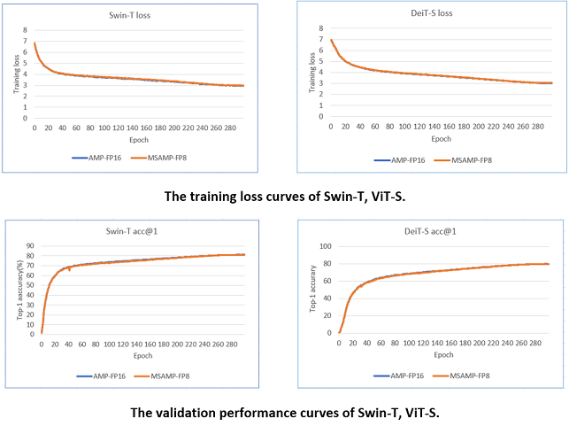
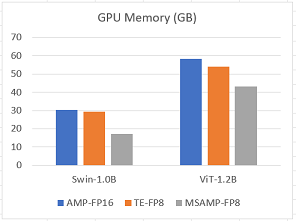

# Introduction

## Features

__MS-AMP__ is an automatic mixed precision package for deep learning developed by Microsoft:

Features:

* Support O1 optimization: Apply FP8 to weights and weight gradients and support FP8 in communication.
* Support O2 optimization: Support FP8 for two optimizers(Adam and AdamW).
* Support O3 optimization: Support FP8 in DeepSpeed ZeRO optimizer.
* Provide four training examples using FP8: Swin-Transformer, DeiT, RoBERTa and GPT-3.

MS-AMP has the following benefit comparing with Transformer Engine:

* Support the new FP8 feature that is introduced by latest accelerators (e.g. H100).
* Speed up math-intensive operations, such as linear layers, by using Tensor Cores.
* Speed up memory-limited operations by accessing one byte compared to half or single-precision.
* Reduce memory requirements for training models, enabling larger models or larger minibatches.
* Speed up communication for distributed model by transmitting lower precision gradients.

## Performance

### Accuracy: no loss of accuracy

We evaluated the training loss and validation performance of three typical models, Swin-Transformer, DeiT and RoBERTa, using both MS-AMP O2 and FP16 AMP. Our observations showed that the models trained with MS-AMP O2 mode achieved comparable performance to those trained using FP16 AMP. This demonstrates the effectiveness of the Mixed FP8 O2 mode in MS-AMP.

Here are the results for Swin-T, DeiT-S and RoBERTa-B:

### Memory

MS-AMP preserves 32-bit accuracy while using only a fraction of the memory footprint on a range of tasks, including the DeiT model and Swin Transformer for ImageNet classification. For example, comparing with FP16 AMP, MS-AMP with O2 mode can achieve 44% memory saving for Swin-1.0B and 26% memory saving for ViT-1.2B. The proportion of memory saved will be more obvious for larger models.

Here are the results for Swin-1.0B and ViT-1.2B.

For detailed setting and results, please go to [MS-AMP-Example](https://github.com/Azure/MS-AMP-Examples).