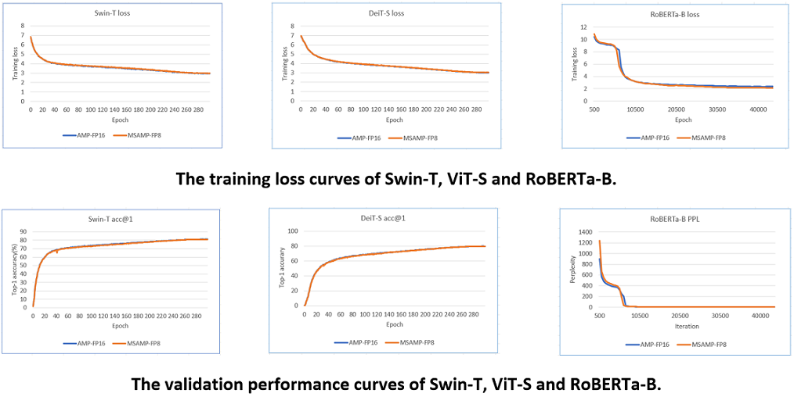
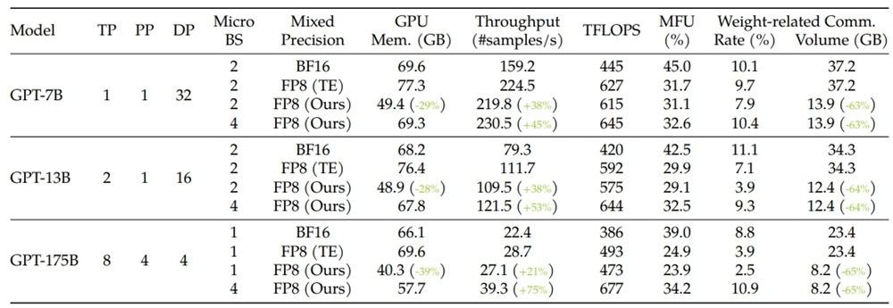

# Introduction

## Features

__MS-AMP__ is an automatic mixed precision package for deep learning developed by Microsoft.

Features:

* Support O1 optimization: Apply FP8 to weights and weight gradients and support FP8 in communication.
* Support O2 optimization: Support FP8 for two optimizers(Adam and AdamW).
* Support O3 optimization: Support FP8 for distributed parallel training and ZeRO optimizer, which is essential for training large scale model.
* Provide four training examples applying MS-AMP: Swin-Transformer, DeiT, RoBERTa and GPT-3.

MS-AMP has the following benefit comparing with Transformer Engine:

* Speed up memory-limited operations by accessing one byte compared to half or single-precision.
* Reduce memory requirements for training models, enabling larger models.
* Speed up communication for distributed model by transmitting lower precision gradients.
* Reduce training time for large language models with larger minibatches.

## Performance

### Model performance

We evaluated the training loss and validation performance of four typical models, GPT-3, Swin-Transformer, DeiT and RoBERTa, using both MS-AMP and FP16 AMP/BF16. Our observations showed that the models trained with MS-AMP achieved comparable performance to those trained using FP16 AMP/BF16. This demonstrates the effectiveness of the mixed FP8 in MS-AMP.

Here are the results for GPT-3, Swin-T, DeiT-S and RoBERTa-B.

### System peroformance

MS-AMP preserves high-precision's accuracy while using only a fraction of the memory footprint on a range of tasks, including GPT-3, DeiT and Swin Transformer. For example, when trainig GPT-175B on NVIDIA H100 platform, MS-AMP achieves a notable 42% reduction in real memory usage compared with BF16 mixed-precision aproch and reduces training time by 17% compared with Transforme Engine. For small models, MS-AMP with O2 mode can achieve 44% memory saving for Swin-1.0B and 26% memory saving for ViT-1.2B, comparing with FP16 AMP.

Here are the resuls for GPT-3:

Here, TP, PP, and DP represent tensor, pipeline, and data parallelism respectively. BS indicates batch size, while MFU denotes model FLOPs utilization. Weight-related communication contains the all-gather operator on weights and the reduce-scatter operator on weight gradients.

Here are the results for Swin-1.0B and ViT-1.2B.

For detailed setting and results, please go to [MS-AMP-Example](https://github.com/Azure/MS-AMP-Examples).
